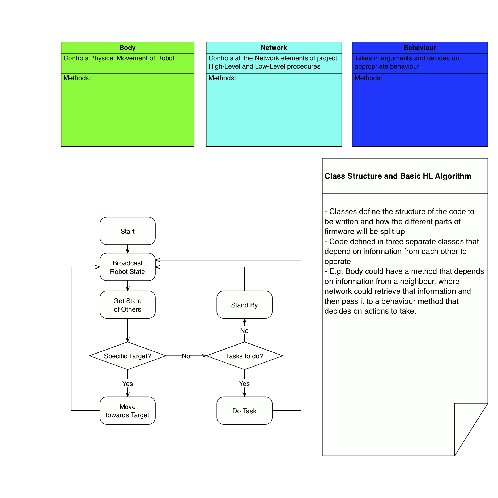

Swarm
=======
Description
-----------
This code repository holds the code for a swarm robotics project, including the mechanical movement control for the body of the robot, the networking between the robots and the behaviour of individual robots.

Code Management
----------------
Whenever a new edit or a task is being undertaken this procedure can be used:
1. Create a new branch, name it with task in mind
2. Edit code until ready for commit
3. Commit code from your branch and open a pull request with any necessary comments
4. 'Code Master' will review pull request and merge with master branch, your branch will then be deleted and changes will be logged in the master branch

